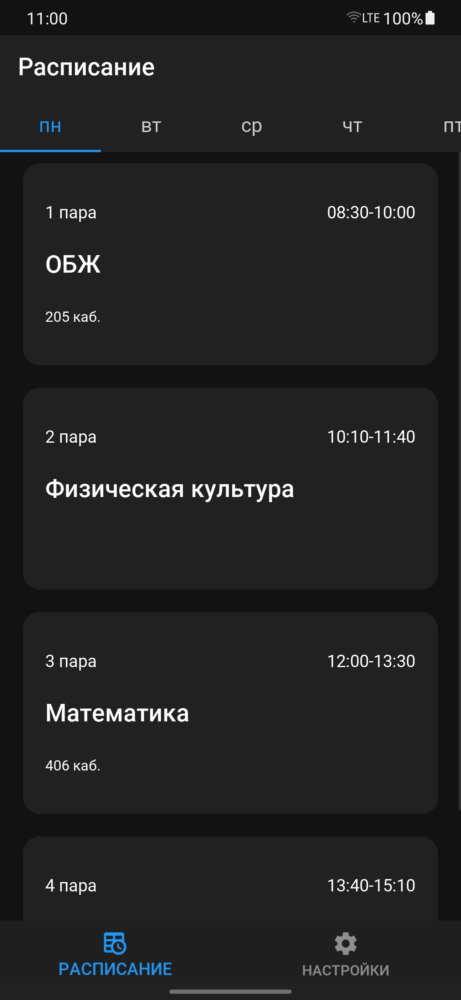
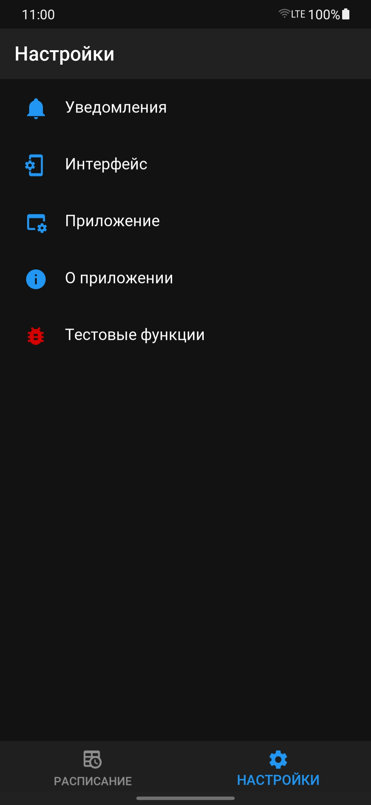

    

<h3 align="center">Мой колледж</h3>
<h4 align="center">Приложение позволяющее смотреть расписание Красногорского колледжа</h4>

 
[![Krstc](https://img.shields.io/badge/%D0%A1%D0%B0%D0%B9%D1%82%20%D0%BA%D0%BE%D0%BB%D0%BB%D0%B5%D0%B4%D0%B6%D0%B0-%D0%BF%D0%B5%D1%80%D0%B5%D0%B9%D1%82%D0%B8-05478e?style=flat&logo=data:image/png;base64,iVBORw0KGgoAAAANSUhEUgAAACAAAAAgCAYAAABzenr0AAAF2UlEQVRYhe1XfWzV1Rl+3nPO/eDeS1vKvdB1lwoNTFIcy9wkJItbh5GBH1DUAJLMDYkOEGK7pCNqskHUmH1EPloUWcYKihY2LR+GLMbMrGwLbpohmZp2rhC4dNBe6r3cy729957zvvujrd5BhXZVkyV7/vrld877vM9583vf5/yAMeDm+taqscQDgBorwf+8ABrN5vkbD5sTHf+qyvTno+yk3O/VFbmC61ZK9YWC3tjXZkVjhx5ZaD81AUuffh2v/bFjTi5nF4vIPGaZzSKBoSApIhAAiiitFB1Xin4/zu9te+KBbx5f851ZoxcwdeWvvb3x1P3WuvXMUlO8phTFiKgLQFwRGRZhAGERqWaWyuK9WqsTxqjNM6ZFXvjb1nuHrcx/CDjWeR63Nu5flM/brcwyFQCIkFZKvWKMPjixPNj+9Ora+N1zqwEMdMHRLctPA8DPDh5H0ytvT+r78FKts7yEmetE4B8U3en3eR5KHlj3+icKuO57u7w98VSTte7BwcQJbfTPQyH/M72tP0gMp75YwOX4woqd4UQy+7C1rh5ACAB7PXpbtLK8sWPndz+qBtWsaqnK5m2gO57a7ljmAYDR6si4cd5VH7689txw5CMRMIQJdz9Tlc3md1vHtYPcr06JlDT4vTrvHCuave5F09nVc9g6XjC44RdfipZvzxcca0VQisAisI5RGvQhnszii+EQEukcRCSqFMVKgz7EelOIlAVwMZOHVgRFhIJlKEUQwJw8l2i0llcDgEer/XfWzrx3/48WsPngVO+jzvECAmCMbl624MuNLevnXe1Q6Pq4AiiuwMmrxMzfeGjN0b92Bazl+6zjpUeOdv4JwDYF4BtGq3aPR++vrprYcK3k/y1e27gIZWXBNaSoEwDyBfv45OXPTRrVILocI/kGLkdoUVNdf67QRgA8Hv0TM7Sw+McH8Id3YncQIQwiKywgghIBSNHxO+dWn9izYeFY9AIArp8++dDf3z/bzSyVzLKMJtQ1V11XURo7dS5ZjwFv6FFEIAAsAiJSlrnCKJUWkbRjOT0lMv7P7/7q+/03N7RWvX+6r+S2OdPe27NhIY9UhP+2LXud4xUAQGWLm18iRW+KyE1E9DZE4oMVUERQAoCIKpilVCv6J4BK6/irRBRXhBALejxGvcksH/S1PfTWiATcvuVJZ/lRADAF5httgetKgr7HQiH/byFXBihFKn0pV2Otm01E8Bv9XsG6CkVkjKY0s0z3+Uz7SCtQDAORI0YRMtn8lEw23zCK2LTWSrk8hwCEoEbh7ILqwSf+3Lvg+jV7zclTPWeFZZLW6sTnfiE5e/bCPcIyCQC0on1m/OKm+6zjAAGYWB5qObNnVf9nlTyy7LlQMpl5CgCIKFFaGtihnOOwLbhnCwX3bPxCavvCTYc/k6rMePB5lUpld4sM2LzXqxu79z7QR195uFV1/OPcb6zjuwDAaLVzRnTCTwsFtsOZUW8ii2gkhIuX8mCRqFYUGx/w4kxPCpMnBJAcNCMCwTqGVgTL4j11PrlpqPe9RrfcdesNK1+ovwU0a1VLVc46b6w3tdk6voMAKEXtwYBvZd/La7s++UwjtuOZmUxuN7PMEQAeo1qnREoe83m0dY4/vpBMu7/FnO9JPlUouB9iYCL2G6O3hUK+zb37Vg97L7iagMjSHdH0pf4hC/YCsB6Pfnza1MgT7zav+GhqXtGGpUuaa/v7C02O5YbBxbzW6ndaq7ZA0Ne+tu7Grk3Lb7pCwIbnj6ldr75Tncnkap3jJc7xfAAGAJSit/x+z/pk27pjl+cbdg7UrHvRnDl94Z6CdQ3O8Zyh9zJAdpFAXUSIg2AgGLqUTnUsJcWEesDmt86bO/3AwUeG94prDqLw0h0zs5ncIsfybRH5OrOEiwUVEyhFPUT0F63ojUDQd6B33+qrfkMjElCMXW904Mm9x8KJRCaat64s6DOVmZztNkb3hctDsV/W39L3rZrKaxN9Wvj/z6nSY/IyAMC/ASw6uxMZ2GJWAAAAAElFTkSuQmCC&link=http://www.krstc.ru/)](http://www.krstc.ru/)

## Описание
Приложение "Мой Колледж" позволяет смотреть расписание Красногорского колледжа без скачивания каких либо файлов
## Скриншоты
  
 

## Требования
* Python == 3.10
* Kivy == 2.1.0
* KivyMD == 1.1.1
* KVDroid == 0.2.9
* Pillow == 9.3.0

## Установка
Для **Android** имеется файл APK во вкладке [Releases](https://github.com/adunyt/mycollege/releases) 
Для **всех остальных платформ** нужно собрать из исходного кода с помощью [Buildozer](https://github.com/kivy/buildozer) 

