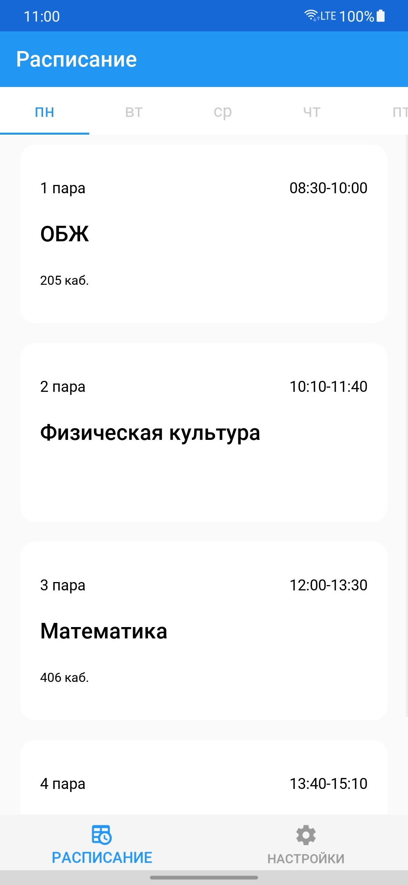
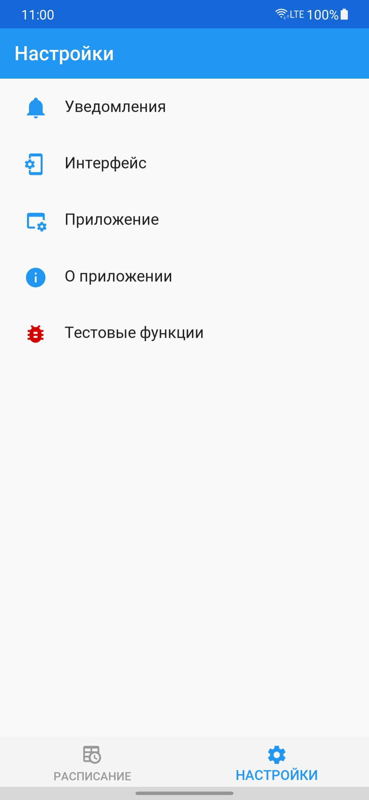

<h2>Мой колледж</h2>

<h4 align="center">Приложение позволяющее смотреть расписание Красногорского колледжа без лишней мороки</h4>

    <a href="https://t.me/adunyt">
        <svg xmlns="http://www.w3.org/2000/svg" width="16" height="16" fill="currentColor" class="bi bi-telegram" viewBox="0 0 16 16">
            <path d="M16 8A8 8 0 1 1 0 8a8 8 0 0 1 16 0zM8.287 5.906c-.778.324-2.334.994-4.666 2.01-.378.15-.577.298-.595.442-.03.243.275.339.69.47l.175.055c.408.133.958.288 1.243.294.26.006.549-.1.868-.32 2.179-1.471 3.304-2.214 3.374-2.23.05-.012.12-.026.166.016.047.041.042.12.037.141-.03.129-1.227 1.241-1.846 1.817-.193.18-.33.307-.358.336a8.154 8.154 0 0 1-.188.186c-.38.366-.664.64.015 1.088.327.216.589.393.85.571.284.194.568.387.936.629.093.06.183.125.27.187.331.236.63.448.997.414.214-.02.435-.22.547-.82.265-1.417.786-4.486.906-5.751a1.426 1.426 0 0 0-.013-.315.337.337 0 0 0-.114-.217.526.526 0 0 0-.31-.093c-.3.005-.763.166-2.984 1.09z"/>
        </svg>
        Телеграм канал
    </a>

<b>Внимание! Приложение находится в стадии альфа-тестирования! О всех увиденных багах сообщать через "Issues" в данном репозитории или сообщать напрямую разработчику!</b>

## Скриншоты

## Описание
Приложение "Мой Колледж" позволяет смотреть расписание Красногорского колледжа без скачивания каких либо файлов или дополнительных приложений!

## Установка и обновления
Вы можете установить данное приложение на устройство Android с помощью APK файла, который можно скачать во вкладке [Releases](https://github.com/adunyt/mycollege/releases). 

Альтернативным же методом считается сборка debug версии APK с помощью исходного кода, тем самым получая самую свежую версию приложения на своё устройство. Но данный метод труден для обычного пользователя, поэтому рекомендуется использовать вышесказанный способ.